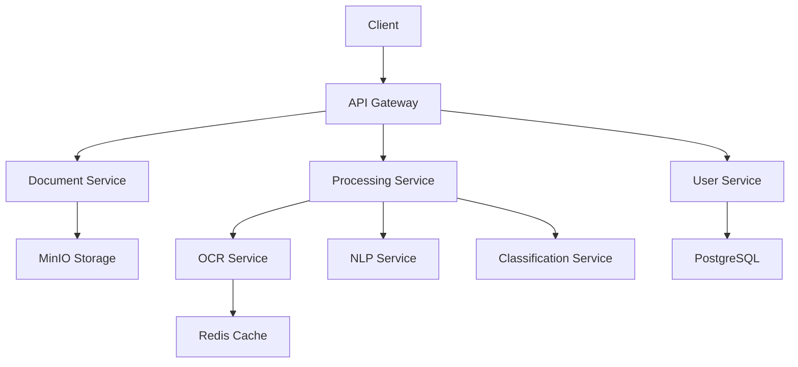
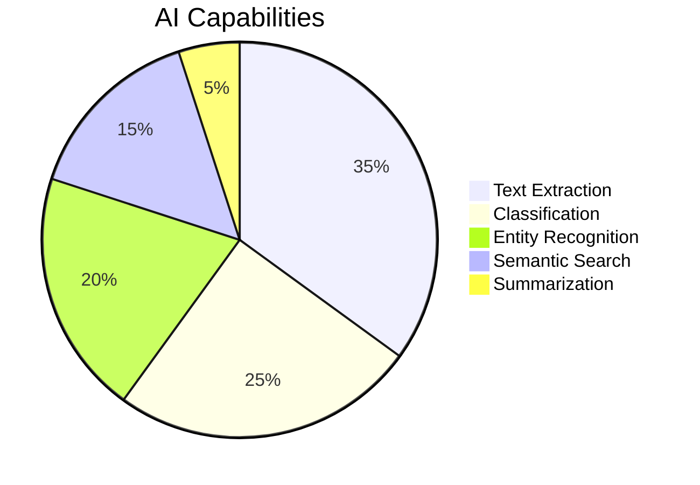

# DocuMind AI 🧠📄

> **Intelligent Document Processing Platform** > _Harnessing AI to transform documents into actionable insights_

<div align="center">
  
  
  
  
  
</div>

## ✨ Key Features

<div class="features-grid"> <div> <h3>📄 Document Processing</h3> <ul> <li>Multi-format support (PDF/DOCX/Images)</li> <li>Batch processing</li> <li>Version control</li> </ul> </div> <div> <h3>🔍 Intelligent Analysis</h3> <ul> <li>Automated classification</li> <li>Entity extraction</li> <li>Document summarization</li> </ul> </div> <div> <h3>⚡ Performance</h3> <ul> <li>Distributed processing</li> <li>Real-time status updates</li> <li>Scalable architecture</li> </ul> </div> </div>

## 🚀 Getting Started

### Prerequisites

| Requirement | Version | Installation Guide                                                |
| ----------- | ------- | ----------------------------------------------------------------- |
| Java        | 21+     | [OpenJDK](https://openjdk.java.net/install/)                      |
| Python      | 3.11+   | [Python Docs](https://www.python.org/downloads/)                  |
| Docker      | Latest  | [Docker Desktop](https://www.docker.com/products/docker-desktop/) |
| Maven       | 3.9+    | [Maven Install](https://maven.apache.org/install.html)            |

### Quick Setup

```bash
git clone https://github.com/yourusername/documind-ai.git
cd documind-ai
./scripts/setup-dev.sh  # Installs dependencies & configures environment
```

### Service Dashboard

| Service             | URL                           |
| ------------------- | ----------------------------- |
| API Gateway         | http://localhost:8080         |
| Swagger UI          | http://localhost:8080/swagger |
| RabbitMQ Management | http://localhost:15672        |
| MinIO Console       | http://localhost:9001         |

## 🏗️ System Architecture



### Core Services

| Service            | Port | Description                      |
| ------------------ | ---- | -------------------------------- |
| API Gateway        | 8080 | Unified entry point with auth    |
| User Service       | 8081 | Authentication & user management |
| Document Service   | 8082 | File Storage & Metadata          |
| Processing Service | 8083 | AI Pipeline orchestration        |

### AI Modules



## 📚 API Examples

### Document Upload

```bash
curl -X POST http://localhost:8080/api/documents \
  -F "file=@contract.pdf" \
  -H "Authorization: Bearer $TOKEN"
```

### Semantic Search

```python
import requests

response = requests.get(
  "http://localhost:8080/api/documents/search",
  params={"q": "NDA agreement", "threshold": 0.8},
  headers={"Authorization": f"Bearer {token}"}
)
```

## 📜 License

Distributed under the MIT License. See [LICENSE](LICENSE) for more information.

<div align="center">
  <p>Built with ❤️ by <a href="https://github.com/salgue441">Carlos Salguero</a></p>
  <p>  </a> <a href="https://linkedin.com/in/carlossalgue">  </a> </p> </div>
